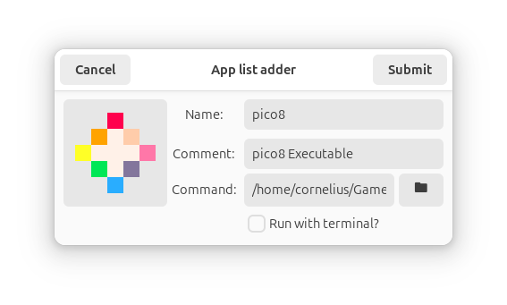

# The Nautilus Application list Adder!
This simply adds a little context menu entry which allows you to add a binary or script to your applications list!


<br>
<sup>Example with Pico 8</sub>

## To install!
run these commands with nautilus closed
```Bash
git clone https://github.com/coffandro/Nautilus-Application-Adder.git
cd Nautilus-Application-Adder
./install.sh -i
```
or as a self cleaning one liner:
```Bash
git clone https://github.com/coffandro/Nautilus-Application-Adder.git && cd Nautilus-Application-Adder && ./install.sh -i && cd .. && rm -r Nautilus-Application-Adder
```

## To configure!
Simply modify the configuration file at `~/.local/share/nautilus-python/extensions/NautilusAppAdder/config.json` 
```Bash
nano ~/.local/share/nautilus-python/extensions/NautilusAppAdder/config.json
```
