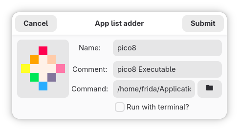

# The Nautilus Application list Adder!
This simply adds a little context menu entry which allows you to add a binary or script to your applications list!


<br>
<sup>Example with Pico 8</sub>

## Installation Methods

### Method 1: GNOME Extension (Recommended)

The GNOME extension automatically installs and manages the Nautilus extension for you. When you enable the extension, it installs the Nautilus context menu; when you disable it, it removes it.

#### Install from source:
```Bash
git clone https://github.com/coffandro/Nautilus-Application-Adder.git
cd Nautilus-Application-Adder
mkdir -p ~/.local/share/gnome-shell/extensions/nautilus-application-adder@coffandro.github.io
cp -r gnome-extension/* ~/.local/share/gnome-shell/extensions/nautilus-application-adder@coffandro.github.io/
cp -r Extension ~/.local/share/gnome-shell/extensions/nautilus-application-adder@coffandro.github.io/
```

Then restart GNOME Shell (press `Alt+F2`, type `r`, and press Enter on X11, or log out and log back in on Wayland).

Enable the extension using GNOME Extensions app or:
```Bash
gnome-extensions enable nautilus-application-adder@coffandro.github.io
```

To disable:
```Bash
gnome-extensions disable nautilus-application-adder@coffandro.github.io
```

### Method 2: Manual Installation (Alternative)

If you prefer not to use the GNOME extension, you can install manually using the install script:

```Bash
git clone https://github.com/coffandro/Nautilus-Application-Adder.git
cd Nautilus-Application-Adder
./install.sh -i
nautilus -q
```

Or as a self-cleaning one liner:
```Bash
git clone https://github.com/coffandro/Nautilus-Application-Adder.git && cd Nautilus-Application-Adder && ./install.sh -i && cd .. && yes "yes" | rm -rI Nautilus-Application-Adder && nautilus -q
```

To remove:
```Bash
./install.sh -r
```

## Requirements

- GNOME Shell 45+ (for GNOME extension method)
- `python-nautilus` / `python3-nautilus` / `nautilus-python` package (automatically installed by `install.sh`)

## To configure!
Simply modify the configuration file at `~/.local/share/nautilus-python/extensions/NautilusApplications/config.json` 
```Bash
nano ~/.local/share/nautilus-python/extensions/NautilusApplications/config.json
```
